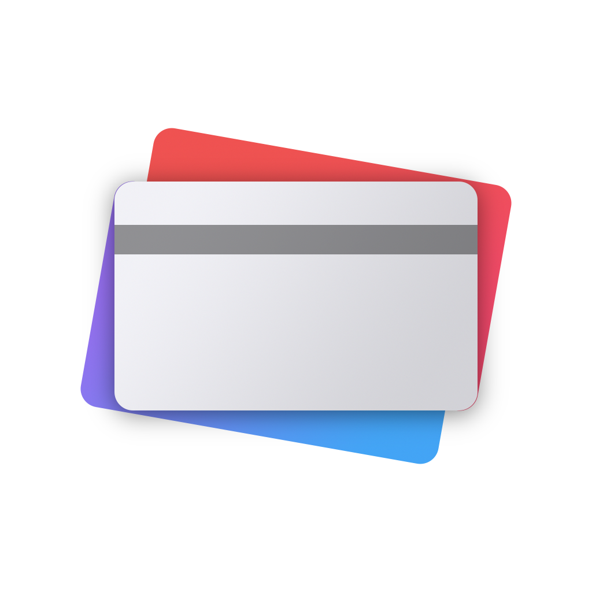
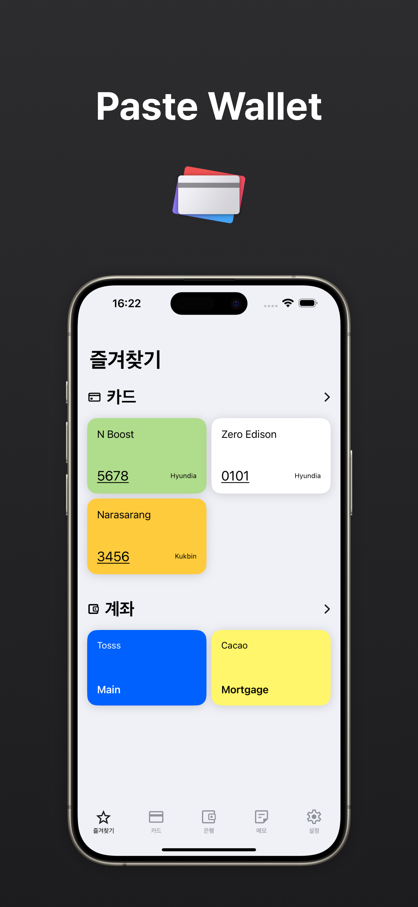
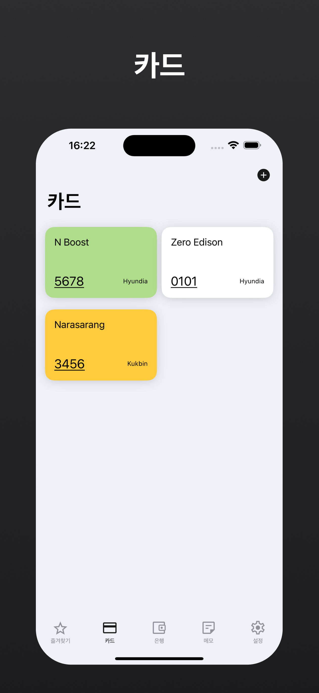
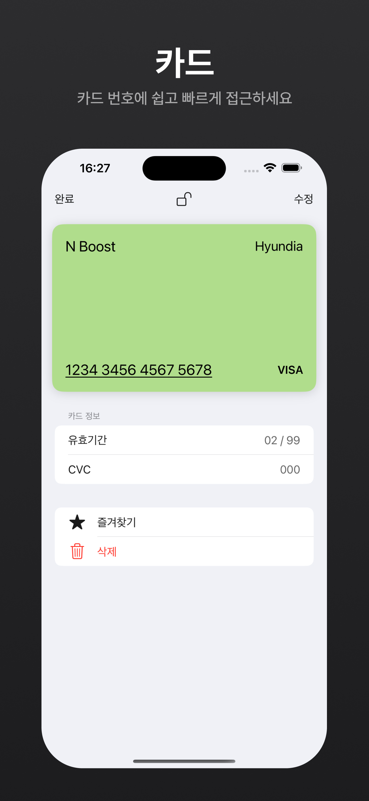
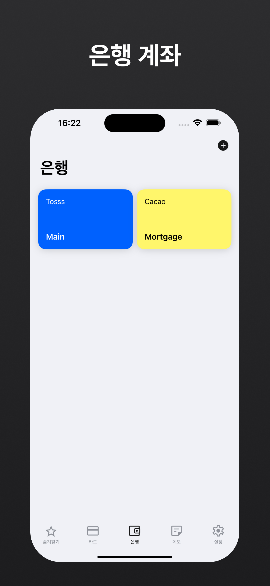
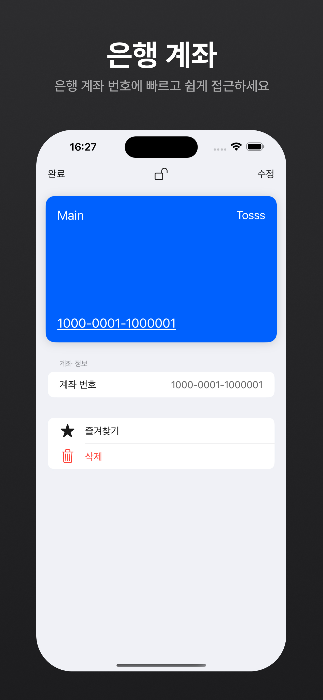
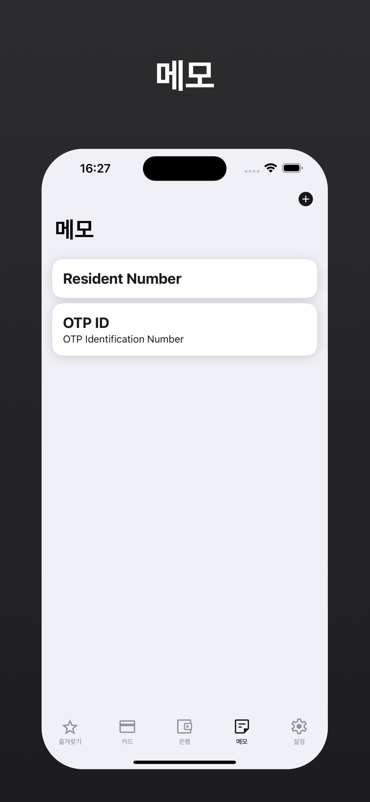
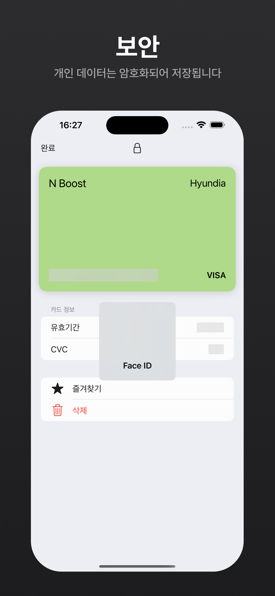
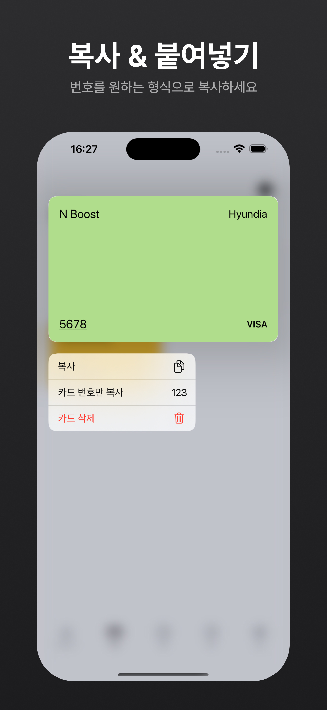
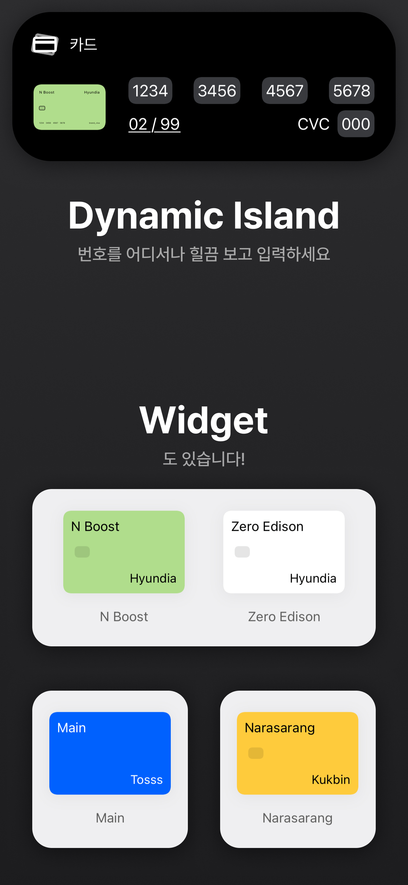

# Paste Wallet

> 카드번호, 은행계좌 이곳에 쏘옥

카드나 계좌 번호를 안전하게 저장하고 빠르게 복사하여 사용할 수 있습니다.

## 기능

### 카드 번호 복사

페이스트 월렛에 카드 정보를 입력해두면 필요할 때 복사해서 사용할 수 있어요.

카드 번호만 복사하거나, '-'를 포함해서 복사하는 것도 가능해요.

### 계좌번호 복사

정산할 때, 페이스트 월렛에 등록된 계좌번호를 빠르게 복사해서 사용하세요.

카드번호와 마찬가지로 '-'를 포함하거나 번호만 복사하는 것도 가능해요.

### 메모

민감한 정보인데, 자주 사용하는 정보가 있다면 메모에 저장해서 사용하세요.

카드와 계좌번호와 마찬가지로 기기 내부에 암호화되어 저장됩니다.

### Live Activity와 Dynamic Island

카드나 계좌번호를 복사해서 사용할 때도 있지만, 모든 웹사이트가 친절하지는 않죠.

Dynamic Island에 정보를 띄워놓고 필요할 때 힐끗 보면서 사용해요.

## Screenshots

### iPhone (6.7")

  
  
  
  
  
  
  
  
  

|  |  |  |  |  |  |  |  | 

### iPad (12.9")

  
  
  
  
  
  

## App Store

[App Store](https://apps.apple.com/kr/app/%ED%8E%98%EC%9D%B4%EC%8A%A4%ED%8A%B8-%EC%9B%94%EB%A0%9B/id6465990967) 에서 더 알아보기

## License

1. [Swift Composable Architecture](https://github.com/pointfreeco/swift-composable-architecture)
2. [CryptoSwift](https://github.com/krzyzanowskim/CryptoSwift)
3. [SwiftKeychainWrapper](https://github.com/jrendel/SwiftKeychainWrapper)

